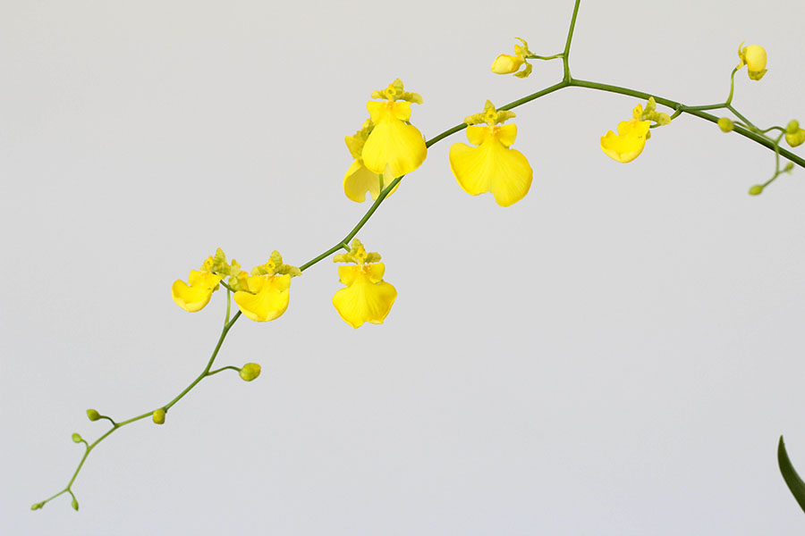
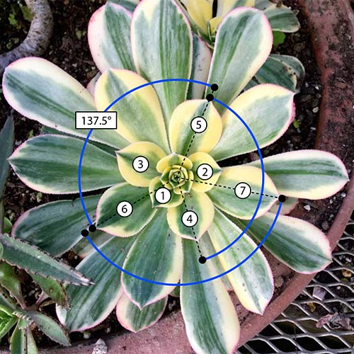
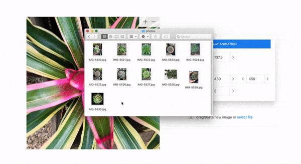
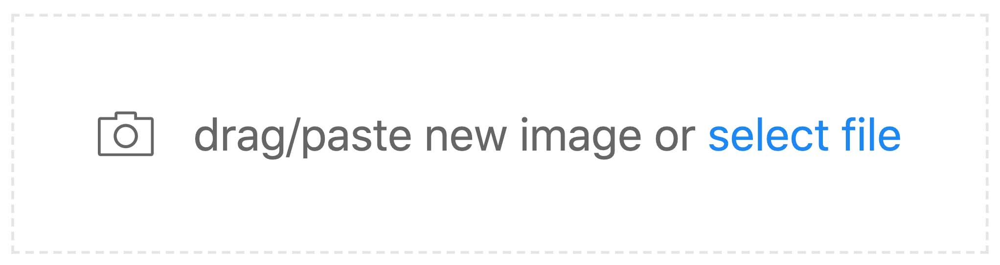
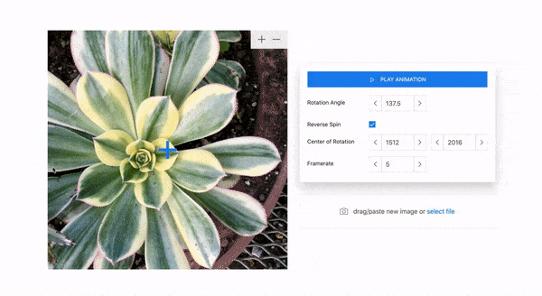
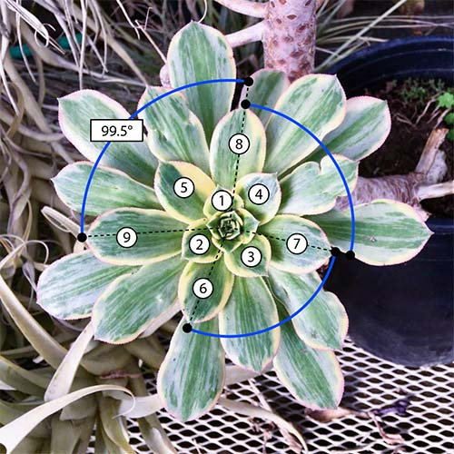
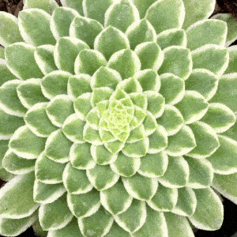
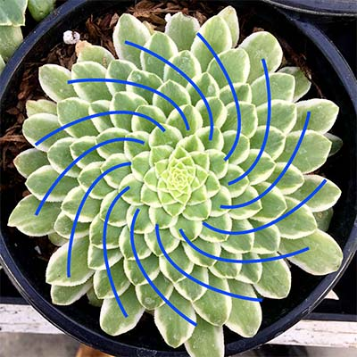
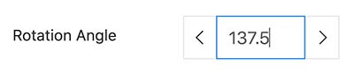
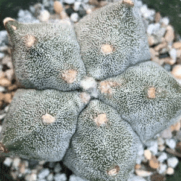

# BOTANIGRAM

Live Demo at: [apps.amandaghassaei.com/botanigram/](https://apps.amandaghassaei.com/botanigram/)

Created by [Amanda Ghassaei](https://amandaghassaei.com/).

This project was inspired by the ["Blooms" series of work by John Edmark](http://www.johnedmark.com/phifib/2016/4/28/blooms-strobe-animated-phi-based-sculptures).  I came across an interview where Edmark describes how you can [spin real plants to produce similar animated effects](http://www.johnedmark.com/natural-blooms-1/2016/4/29/strobe-animated-artichoke-an-example-of-a-naturally-occurring-bloom) and found myself wishing I could test it out on every plant I saw around me.

### How Does This Work?

A single image of a plant contains information about the past and the future of the organism.  You can look at a single branch of flowers and see every stage of the development process: from tiny buds to fully opened blooms:

Similarly, the image below shows many stages of leaf development.  The large leaves around the outside of the plant were formed first and the smallest leaves in the center formed most recently:

Sequential leaves on this plant are spaced by the golden angle (137.5 degrees) – this is common to many species of plants you encounter on a daily basis.  By rotating the image in increments of 137.5 degrees, we can place sequential leaves in approximately the same spot in space - giving the illusion that the leaf is slowly morphing from a small leaf bud into a fully mature leaf.  This works in the same way as an early animation device called a [zoetrope](https://en.wikipedia.org/wiki/Zoetrope).  Zoetropes work by displaying a sequence of gradually changing images, giving the illusion of motion (or, in this case, growing).

The golden angle is related to some other mathematical concepts: the Fibonacci series and the golden ratio.  If you're interested in learning more about the relationship between math and the growth patterns of plants, I recommend checking out the incredible three part YouTube series: ["Doodling in Math: Spirals, Fibonacci, and Being a Plant"](https://www.youtube.com/watch?v=ahXIMUkSXX0) by Vi Hart.

### Source Code

All source code for this project is available on [Github](https://github.com/amandaghassaei/botanigram).

## Instructions

This app creates stop-motion animations of plants by rotating a single image to create a "growing" illusion.  It's based on a natural phenomenon called the [golden angle](https://en.wikipedia.org/wiki/Golden_angle#Golden_angle_in_nature), where leaves and petals of plants across many different species grow with similar angular spacing between them.  The golden angle is responsible for the spiral patterns on pinecones and sunflowers; it is related to the Fibonacci series and the golden ratio.

###  What Types of Plants Will Work?

Experiment with what you can find around you!  Pinecones, cacti, and succulents usually work well, but even common plants like weeds growing in the cracks of the sidewalk or vegetables from the grocery store can produce stunning animations.  Ideal subjects are symmetric with many stages of development visible in a single image.  Look for plants exhibiting [Fibonacci spirals](https://en.wikipedia.org/wiki/Golden_ratio#Nature).

### Photography Tips

No special photography equipment required.  Center the camera over your subject and take a single overhead shot.  The best photographs are evenly lit, ideally with diffuse, indirect lighting.  If you are photographing in direct sunlight, try to cast a shadow over your subject to improve the quality of your animations.

### Import Your Photo

Import your photo by dragging it directly into the app or copying and pasting it into the app.  You can also select a file from your device using the "select file" link under the control panel.  While using this app, your photos never leave your computer (they are not uploaded to a server).

### Select Center of Rotation

While the animation is paused, select the center of rotation by clicking directly on the image viewer.  Pinch/scroll to enlarge the image and drag the image slowly or use the left/right and up/down arrows on your keyboard to make fine adjustments to the center of rotation.

### What Rotation Angle Should I Use?

Short answer: Use the golden angle (137.5 degrees), this will work in the majority of cases.

Long answer: The rotation angle required to create a great animation depends on your image and the growth dynamics of your subject.  Many plants grow with golden angle spacing between sequential leaves, so try 137.5 degrees first.  The image above shows leaf order labeled and the golden angle indicated between leaves 4/5, 5/6, and 6/7.

Many plants grow with pairs of leaves spaced 180 degrees from each other.  These are worth a try, but in general they won't create as strong of a growing illusion.

Leaf spacing can vary from species to species or arise from unique environmental factors during a plant's development – occasionally, two plants of the same species may even display different leaf spacings.  If the golden angle doesn't work, you might also try the Lucas angle (99.5 degrees).  Lucas angle plants are relatively uncommon, but if you photograph enough plants you will see one eventually:

A great explanation of the golden angle, Lucas angle, and how this all relates to plant growth can be found in the video ["Doodling in Math: Spirals, Fibonacci, and Being a Plant"](https://www.youtube.com/watch?v=ahXIMUkSXX0).

You can also experiment with different angles see how it affects the animation; there may be more than one "right" answer.  This succulent has 137.5 degree leaf spacing, but the animation progresses very slowly using the golden angle:

If you can identify distinct spirals on your plant, you might try dividing 360 by the number of spiral arms, or use some integer multiple of this angle.  I counted 13 spirals arms, so I used 360 / 13 = 27.6 degrees as a starting point:

From there, I found that if I multiplied 27.6 by 2 (55.3 degrees) and adjusted the angle slightly to 52.9 degrees, the animation stabilized to something that evolves more quickly:

Other multiples of 27.6 degrees might be worth looking at as well.  In fact, the golden angle of 137.5 degrees is approximately 27.6 * 5 = 138 degrees (this is not a coincidence, it comes straight from the Fibonacci series).  If you select the "Rotation Angle" control, you can press the up and down arrow keys to quickly scan through angles and experiment:

Another example is this star-shaped cactus, which more-or-less "works" at 137.5 degrees:

Since this cactus has five arms coming out of it, the angle between adjacent arms is 360 / 5 = 72 degrees.  I noticed that sequential spots on the cactus are spaced 2 arms apart, so I set the angle to 72 * 2 = 144 degrees to fix the orientation of the plant in the animation:

### I Made Something, Now What?

You can export your animation as a GIF, MP4 video, or still PNG frames.  Once you get the hang of it, feel free to [submit your animations](#modal-gallery) to be featured in app!

### More Ideas

Here are ideas for challenging examples I'm hoping to include in this app, please [submit images](#modal-gallery) if you have them:

- Strawberry: the patterns of seeds form Fibonacci spirals, but you likely need a very symmetric strawberry for it to work.
- Romanesco broccoli (fractal broccoli): again, needs to be very symmetric – I've noticed most of these tend to have a slight curve, maybe a single floret would work better.
- Celery rosette: if you cut a very large head of celery at the base, the cross section of the stalks should create a nice effect.
- Dahlia/sunflower/daisy: must be very symmetric to work.
- Fennel flowers (or some other branched flower like Queen Anne's lace)

Some easy plants that I'm hoping to get more examples of:

- Cabbage slices: sliced cabbage (especially red cabbage) works great in the app.
- Astrophytum asterias (e.g. sea urchin cactus, sand dollar cactus): the little tufts and patterns on these cacti make great animations!

Other types of objects that exhibit spirals or Fibonacci patterns might be interesting to try (e.g. shells) – experiment with using different rotation angles as the Golden Angle may not apply.

### Feedback

Send feedback/bugs to [botanigram@gmail.com](mailto:botanigram@gmail.com?subject=Feedback) or leave an issue on [Github](https://github.com/amandaghassaei/botanigram).